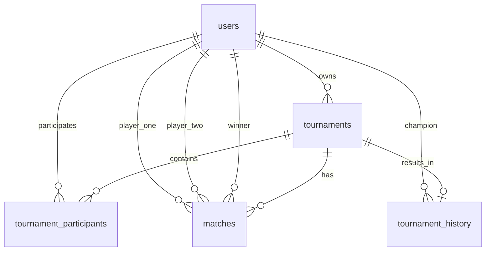

# Tennis League API — Contexto do Projeto

## Objetivo do Produto

API para criação e gerenciamento de torneios de tênis amadores. Usuários podem se cadastrar, criar torneios com limite de participantes, inscrever-se em torneios, gerar chaveamento automático (mata-mata), registrar resultados de partidas e manter histórico de campeões e estatísticas individuais.

---

## Arquitetura

### Stack

| Camada | Tecnologia |
|---|---|
| Runtime | Node.js 22 |
| Linguagem | TypeScript |
| Framework | Express |
| ORM | Prisma |
| Banco | PostgreSQL 17 |
| Documentação | Swagger (swagger-jsdoc + swagger-ui-express) |
| Upload | Multer |
| Autenticação | JWT + Bcrypt |
| Testes | Jest |
| Container | Docker + docker-compose |

### Estrutura de Pastas

```
src/
├── config/            # Configurações (Swagger, multer, etc.)
│   ├── swagger.ts
│   └── multer.ts
├── modules/           # Módulos da aplicação (domain-driven)
│   ├── auth/          # Autenticação (login, registro)
│   │   ├── dto/
│   │   ├── auth.controller.ts
│   │   ├── auth.service.ts
│   │   ├── auth.repository.ts
│   │   └── auth.routes.ts
│   ├── users/         # Perfil do usuário
│   │   ├── dto/
│   │   ├── users.controller.ts
│   │   ├── users.service.ts
│   │   ├── users.repository.ts
│   │   └── users.routes.ts
│   ├── tournaments/   # CRUD de torneios
│   ├── participants/  # Gerenciamento de participantes
│   ├── matches/       # Partidas e resultados
│   └── statistics/    # Estatísticas dos usuários
├── middlewares/        # Middlewares globais (auth, erro, etc.)
│   ├── auth.middleware.ts
│   └── errorHandler.ts
├── shared/            # Código compartilhado (Prisma client, erros, config)
│   ├── prisma.ts
│   ├── config.ts
│   └── errors/
├── routes/            # Definição centralizada de rotas
│   └── index.ts
├── app.ts             # Configuração do Express
└── server.ts          # Inicialização do servidor
```

### Padrão Arquitetural

MVC simplificado por módulo:

- **Controller** — manipula requisição/resposta, valida entrada
- **Service** — regras de negócio
- **Repository** — acesso a dados via Prisma
- **DTO** — tipagem de entrada/saída

Cada módulo possui essa estrutura internamente.

---

## Banco de Dados

### Modelo Relacional



### Tabelas

#### users
| Coluna | Tipo | Restrição |
|---|---|---|
| id | UUID | PK |
| name | String | NOT NULL |
| email | String | UNIQUE, NOT NULL |
| password | String | NOT NULL (hash bcrypt) |
| avatar | String? | URL ou path |
| created_at | DateTime | DEFAULT now() |
| updated_at | DateTime | ON UPDATE |

#### tournaments
| Coluna | Tipo | Restrição |
|---|---|---|
| id | UUID | PK |
| owner_id | UUID | FK -> users.id |
| name | String | NOT NULL |
| description | String? | |
| max_players | Int | NOT NULL |
| status | Enum | WAITING \| STARTED \| FINISHED |
| created_at | DateTime | |
| updated_at | DateTime | |

#### tournament_participants
| Coluna | Tipo | Restrição |
|---|---|---|
| id | UUID | PK |
| tournament_id | UUID | FK -> tournaments.id |
| user_id | UUID | FK -> users.id |
| joined_at | DateTime | |
| | | UNIQUE(tournament_id, user_id) |

#### matches
| Coluna | Tipo | Restrição |
|---|---|---|
| id | UUID | PK |
| tournament_id | UUID | FK -> tournaments.id |
| player_one_id | UUID | FK -> users.id |
| player_two_id | UUID? | FK -> users.id (pode ser null para bye) |
| winner_id | UUID? | FK -> users.id |
| round | Int | NOT NULL |
| status | Enum | PENDING \| FINISHED |
| created_at | DateTime | |

#### tournament_history
| Coluna | Tipo | Restrição |
|---|---|---|
| id | UUID | PK |
| tournament_id | UUID | FK -> tournaments.id, UNIQUE |
| champion_id | UUID | FK -> users.id |
| finished_at | DateTime | |

### Relacionamentos

- **User 1:N Tournament** — usuário cria vários torneios
- **User N:M Tournament** (via `tournament_participants`) — usuário participa de vários torneios
- **Tournament 1:N Match** — torneio gera várias partidas
- **Tournament 1:1 TournamentHistory** — torneio finalizado tem um registro de campeão
- **Match N:1 User** (player_one, player_two, winner)

---

## Regras de Negócio

### Usuários
- Email deve ser único
- Senha armazenada com hash bcrypt
- Apenas usuário autenticado pode editar próprio perfil
- `GET /users/me` retorna dados do usuário autenticado (sem hash da senha)
- `PUT /users/me` permite alterar `name` e `avatar`
- `PUT /users/password` exige `currentPassword` e `newPassword` (mínimo 6 caracteres, diferente da atual)
- `POST /users/avatar` aceita upload de imagem (JPEG, PNG, WebP) via Multer, salva localmente em `uploads/`
- Arquivos de avatar são servidos estaticamente em `/uploads`

### Torneios
- Apenas o **dono** pode editar/excluir/iniciar o torneio
- Status `WAITING` → aceita inscrições
- Status `STARTED` → inscrições bloqueadas, partidas em andamento
- Status `FINISHED` → torneio encerrado, campeão definido
- `max_players` define o limite de participantes

### Participantes
- Usuário não pode se inscrever duas vezes no mesmo torneio (UNIQUE)
- Não pode entrar em torneio já iniciado
- Valida limite de jogadores antes de inscrever

### Partidas
- Ao iniciar torneio: embaralhar participantes e gerar confrontos do round 1
- Apenas o dono do torneio pode registrar resultado
- Ao registrar vencedor: partida fecha como `FINISHED` e vencedor avança
- Quando resta 1 jogador → torneio finalizado, campeão registrado em `tournament_history`

### Estatísticas
- `tournamentsPlayed` — total de torneios que participou
- `tournamentsWon` — total de torneios que venceu
- `matchesPlayed` — total de partidas disputadas
- `matchesWon` — total de partidas vencidas
- `winRate` — (matchesWon / matchesPlayed) * 100

---

## Convenções

### Código
- **Idioma**: código e comentários em português ou inglês (manter consistência)
- **Nome de arquivos**: kebab-case (ex.: `error-handler.ts`)
- **Classes/Interfaces**: PascalCase
- **Variáveis/Funções**: camelCase
- **Constantes**: UPPER_SNAKE_CASE
- **Enum**: PascalCase, valores UPPER_SNAKE_CASE
- **Tabelas no banco**: snake_case (ex.: `tournament_participants`)
- **Colunas no banco**: snake_case (mapeado via `@map`)
- **Modelos Prisma**: PascalCase singular (ex.: `TournamentParticipant`)

### API
- Prefixo `/api` para todas as rotas
- Respostas no formato JSON
- Erros seguem padrão `{ error: string, statusCode: number }`
- Paginação: `?page=1&limit=10` → `{ data: [], total, page, limit }`

### Git
- Commits em português ou inglês, imperativo
- Uma funcionalidade por commit

---

## Tecnologias Utilizadas

| Pacote | Versão | Finalidade |
|---|---|---|
| Node.js | ^22 | Runtime |
| TypeScript | ^5 | Tipagem estática |
| Express | ^4 | Framework HTTP |
| Prisma | ^6 | ORM e migrations |
| @prisma/client | ^6 | Cliente do banco |
| PostgreSQL | 17 | Banco de dados |
| Docker | latest | Container do banco |
| swagger-jsdoc | ^7 | Geração de spec OpenAPI |
| swagger-ui-express | ^5 | UI do Swagger |
| cors | ^2 | CORS |
| dotenv | ^16 | Variáveis de ambiente |
| bcryptjs | ^3 | Hash de senhas |
| jsonwebtoken | ^9 | JWT |
| zod | ^4 | Validação de schemas |
| multer | ^2 | Upload de arquivos |
| tsx | ^4 | Execução TypeScript em dev |
| Jest | ^29 | Testes |
| ts-jest | ^29 | Suporte TS no Jest |
| ESLint | ^9 | Linter |
| Prettier | ^3 | Formatador |
